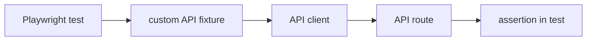

# Avexa Playwright Test Framework

Workspace package `@avexa/playwright`. Chromium end-to-end coverage for the Avexa web app against an isolated `avexa_test` database.

## 1. Purpose

The suite covers:

- UI flows (Clients navigation/create, Viewer control visibility)
- REST API create/read/update/delete where those routes exist
- RBAC and authorization (Admin, QA Engineer, Viewer, anonymous)
- Authentication (Better Auth session cookie via real `/login`)
- Validation failures (empty name/title, invalid email)

It does not cover Kafka, contract testing, or browsers other than Chromium.

## 2. Architecture

```
playwright/
  auth/                 # setup project: UI login → storageState files
  api/                  # thin HTTP clients (Playwright request wrapper)
  data/                 # typed payload factories
  fixtures/             # custom test fixtures (API clients, POM, owned client)
  pages/                # Page Objects (ClientsPage only)
  support/db/           # guarded avexa_test cleanup
  tests/
    api/                # domain API specs
    ui/                 # UI specs
  playwright.config.ts
  package.json
  tsconfig.json
```

| Layer | Responsibility |
|---|---|
| **API client** | HTTP transport. Posts/patches/deletes and returns `APIResponse`. No `expect()`. |
| **Factory** | Builds a typed request payload. Does not call the network. |
| **Fixture** | Wires dependencies and lifecycle (create owned client, teardown). |
| **Page Object** | UI locators and interactions. No assertions. |
| **Test** | Business behavior and assertions. |
| **Support** | DB/test-environment utilities (`cleanupTestData`, `assertTestDatabase`). |

## 3. API test flow



API clients take Playwright’s existing `APIRequestContext` (`request`) in the constructor. They do not call `request.newContext()` per method. Cookie auth therefore matches the test’s `storageState`.

Example: `tasksApi.createTask(payload)` → `request.post("/api/v1/tasks", { data })` → test asserts status and body.

## 4. Test-data flow

Typed factories live in `data/`:

| Factory | Required input | Default uniqueness |
|---|---|---|
| `buildTask` | `projectId` | `PW task {timestamp}-{uuid}` |
| `buildClient` | none | `PW client {timestamp}-{uuid}` |
| `buildProject` | `clientId` | `PW project {timestamp}-{uuid}` |
| `buildContact` | `clientId` | unique last name + `pw.contact.{unique}@example.test` |

Overrides replace individual fields (empty name, invalid email) for validation cases.

**Owned test data** means the test (or the `client` fixture) creates a unique row and is responsible for removing it. Successful mutations do not edit shared seed slugs such as `pax8` or `account-management`.

Seed rows are still used when the test only **reads** or expects **403/401**, and when a parent UUID is required but the persona cannot create that parent (QA project on the seeded Pax8 client).

The only data fixture is `client`. There are no `project`, `contact`, or `task` fixtures.

## 5. Cleanup strategy

Prefer the product API when it can delete.

**Tasks** (DELETE exists):

```
create via TasksApi → assert → DELETE via TasksApi
```

The test’s `finally` also DELETEs if the assertion path failed after create.

**Clients / Projects / Contacts** (no DELETE routes):

```
owned row (or owned parent client) → assert → cleanupTestData({ … })
```

`cleanupTestData` deletes only the listed ids/slugs (and their dependent graph) on `avexa_test`. It is not the default cleanup path for Tasks.

Guards in `assertTestDatabase`:

- `DATABASE_URL` must target `avexa_test`
- `ALLOW_TEST_DB_MUTATION` must be `"true"`
- refuses the development database `avexa`
- refuses non-local hosts by default

Admin project/contact tests attach children to the owned `client` fixture; fixture teardown removes the client graph. QA project create uses `cleanupTestData({ projectSlugs })` because Chris cannot create a parent client. The UI “add client” spec cleans up by slug after a UI create.

## 6. Authentication and RBAC

`playwright.config.ts` defines two projects:

1. **`auth-setup`** — empty `storageState`, runs `auth/auth.setup.ts`
2. **`chromium`** — `dependencies: ["auth-setup"]`

Setup logs in through `/login` so Better Auth can set its HttpOnly cookie, then writes gitignored files:

| Persona | Role | File |
|---|---|---|
| Mari | Admin | `.auth/mari.json` |
| Chris | QA Engineer | `.auth/chris.json` |
| Alex | Viewer | `.auth/alex.json` |
| Anonymous | none | `test.use({ storageState: { cookies: [], origins: [] } })` |

Anonymous is not a file. Credentials are the seeded demo accounts (`Password123!`).

Config default `storageState` is Mari. Specs override per `test.describe` with `test.use({ storageState: "..." })`.

Playwright applies that state to both browser `page` and API `request` for the test, so `tasksApi` / `clientsApi` / etc. send the same session cookie.

## 7. Fixtures

`fixtures/test.ts` extends Playwright `test`. All fixtures are **test-scoped**.

| Fixture | Source | Role |
|---|---|---|
| `tasksApi` | `request` | `TasksApi` |
| `clientsApi` | `request` | `ClientsApi` |
| `projectsApi` | `request` | `ProjectsApi` |
| `contactsApi` | `request` | `ContactsApi` |
| `clientsPage` | `page` | `ClientsPage` |
| `client` | `clientsApi` | create unique client, yield `CreatedClient`, teardown via `cleanupTestData` |

```
request
  → clientsApi
    → client
      → automatic teardown
```

`client` throws if create is not HTTP 201 (for example if a Viewer test requested it).

Test-scoped so each test gets a fresh API wrapper, a fresh page object, and — when used — its own client row. Nothing is worker-scoped or shared mutable state.

API and UI specs import `{ test, expect }` from `fixtures/test.ts`. Auth setup stays on `@playwright/test`.

## 8. Page Object Model

`pages/clients.page.ts` is the only Page Object. It exposes locators (`heading`, `addClientButton`, `clientRow`) and actions (`goto`, `openFromHome`, `createClient`).

There is no `BasePage`, `LoginPage`, or navigation class. Login lives in `auth-setup`. Other screens in `viewer.spec.ts` use `page.goto` and `getByRole` because those interactions are not reused.

Assertions stay in the spec (`toBeVisible`, `toHaveCount`). The page object only drives the UI.

## 9. Test organization

```
tests/api/
  tasks.api.spec.ts
  clients.api.spec.ts
  projects.api.spec.ts
  contacts.api.spec.ts
tests/ui/
  clients.spec.ts
  viewer.spec.ts
```

Files are **by domain**, not one RBAC spec. Inside each API file, `describe` blocks are Admin / QA Engineer / Viewer / Anonymous.

`viewer.spec.ts` is a cross-page Viewer UI check (Clients plus Projects, Tasks, Notes, Resources, Team). It is not a second domain POM.

Default UI client specs run as Mari (config `storageState`).

## 10. TypeScript

`playwright/tsconfig.json` extends `@repo/typescript-config/base.json`:

- `strict: true`
- `noUncheckedIndexedAccess: true`
- `module` / `moduleResolution`: `NodeNext`
- `noEmit: true`

The package is `"type": "module"`, so local imports use the `.js` specifier (`../api/clients.api.js`) even though the source is `.ts`.

Request/response shapes are typed (`CreateClientRequest`, `CreatedClient`, `ApiErrorBody`, …). Response readers narrow `unknown` JSON; they do not use `any`.

`npm run check-types -w @avexa/playwright` runs `tsc --noEmit`.

## 11. Playwright configuration

From `playwright.config.ts`:

| Setting | Value |
|---|---|
| Browser | Chromium (`Desktop Chrome`) |
| `baseURL` | `http://localhost:3001` |
| `fullyParallel` | `true` |
| `retries` | `2` on CI, `0` locally |
| `workers` | `2` on CI, Playwright default locally |
| `forbidOnly` | enabled on CI |
| `trace` | `on-first-retry` |
| `screenshot` | `only-on-failure` |
| `video` | `retain-on-failure` |
| Reporters | `list` + `html` (`open: "never"` on CI, `"on-failure"` locally) |
| Default `storageState` | `./.auth/mari.json` |
| `webServer` | `npm run dev:test -w web` on port 3001, `reuseExistingServer: false` |
| Projects | `auth-setup` → `chromium` depends on it |

`webServer` points the app at `avexa_test` (`DATABASE_URL`, `ALLOW_TEST_DB_MUTATION`, `BETTER_AUTH_SECRET`, `BETTER_AUTH_URL`, `AVEXA_PLAYWRIGHT=1`).

`BETTER_AUTH_SECRET` must be set (env, `apps/web/.env.test`, or `apps/web/.env`) or config throws.

## 12. Running tests locally

Postgres must be up (`npm run db:up` from the repo root). Root scripts prepare `avexa_test` first.

From the **repo root**:

```bash
npm run test:e2e      # db:test:prepare && full Playwright suite
npm run test:api      # db:test:prepare && tests/api
npm run test:e2e:ui   # db:test:prepare && tests/ui
```

From the **Playwright package** (does not prepare the database):

```bash
npm run test -w @avexa/playwright            # full suite
npm run test:api -w @avexa/playwright        # API specs (+ auth-setup)
npm run test:e2e-ui -w @avexa/playwright     # UI specs (+ auth-setup)
npm run test:headed -w @avexa/playwright     # headed Chromium
npm run test:ui -w @avexa/playwright         # Playwright UI mode
npm run test:debug -w @avexa/playwright      # Playwright Inspector
npm run check-types -w @avexa/playwright     # tsc --noEmit
```

`test:ui` is **Playwright UI mode** (`playwright test --ui`).  
`test:e2e-ui` / `test:e2e:ui` is the **UI spec folder** (`tests/ui`).

`auth-setup` still runs when you filter to `tests/api` or `tests/ui` because `chromium` depends on it.

## 13. CI

`.github/workflows/playwright.yml` runs on push to `main` and on pull requests.

```
push / PR
  → checkout, Node 22, npm ci
  → Playwright Chromium
  → Playwright typecheck
  → Postgres 17 service (same demo creds as compose.yaml)
  → npm run db:test:prepare   # create/migrate/reset/seed avexa_test
  → npm run test -w @avexa/playwright
  → upload playwright-report + test-results (always, 7 days)
```

CI uses 2 workers, `list` + HTML reporters, 2 retries, and the configured trace/screenshot/video on failure or retry.

No GitHub Actions secrets. Demo `BETTER_AUTH_SECRET` and compose-matching DB credentials are workflow env. Login users are the seeded local-demo accounts, not production credentials.

## 14. Design decisions

- **Domain specs, not one RBAC file** — each domain keeps its own create/validate/forbid cases; personas are `describe` blocks inside the domain.
- **API setup where the assertion is API** — owned client and tasks are created over HTTP, not through the UI.
- **Owned data instead of mutating seed** — parallel tests and a reusable `avexa_test` baseline stay stable.
- **Assertions in tests** — clients return `APIResponse`; page objects return locators/void.
- **Thin API clients** — wrap `request`, no expected-status helper, no second HTTP stack.
- **No BasePage** — one thin Clients POM; more pages only if interactions are reused.
- **No arbitrary sleeps** — waits are Playwright auto-waiting, `waitForURL`, and response status.
- **No worker-scoped mutable data** — fixtures are test-scoped; factories generate unique names.
- **Abstractions only after reuse** — one `client` fixture (three callers); no project/contact/task fixtures.

## 15. Current scope / intentionally not included

- Chromium only
- No Kafka
- No contract-testing framework
- No CD / deployment pipeline
- No Firefox / WebKit suite
- No Page Object per route
- No enterprise secret manager
- No JUnit reporter, Slack, or dashboards
- No `project` / `contact` / `task` data fixtures
- No Client / Project / Contact DELETE API (product limitation; DB cleanup is the workaround)

These are intentional for a single Next.js demo app, not unfinished enterprise scaffolding.

## 16. Interview architecture summary

```
Auth setup (UI login)
        ↓
storageState personas (Mari / Chris / Alex; anonymous = empty)
        ↓
custom fixtures (test-scoped)
     ↙            ↘
API clients      ClientsPage
     ↓                ↓
API tests           UI tests
      ↘            ↙
   owned test data (factories + client fixture)
            ↓
   cleanup (API DELETE for tasks; guarded avexa_test for the rest)
            ↓
   GitHub Actions CI
```
